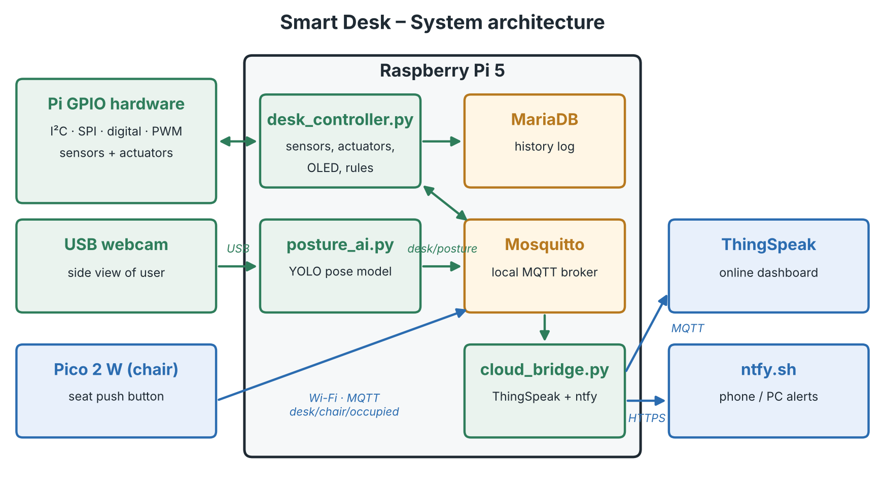

# Smart Desk

IoT Essentials group project (Thomas More, 2026–2027) – **Eggermont Dimitri** & **Lauwers Björn**

A smart desk that tracks presence and seated time, corrects posture with AI,
and controls light, sunshade and cooling. Built on a **Raspberry Pi 5** and a
**Raspberry Pi Pico 2 W**, with a local OLED dashboard and an online
ThingSpeak dashboard.



## Repository layout

```
smart-desk/
├── pi/                     # Everything that runs on the Raspberry Pi 5
│   ├── config.py           # THE contract: pins, thresholds, MQTT topics, settings
│   ├── desk_controller.py  # Main program: sensors → rules → actuators, OLED, DB
│   ├── posture_ai.py       # Webcam + YOLO pose → publishes desk/posture
│   ├── cloud_bridge.py     # desk/# → ThingSpeak (every 15 s) and ntfy alerts
│   ├── check_setup.py      # Verifies the Pi environment (run after setup)
│   ├── sensors/            # One small class per sensor
│   ├── actuators/          # One small class per actuator
│   └── tests/              # One stand-alone test script per component
├── pico/                   # CircuitPython code for the Pico 2 W (seat sensor)
│   ├── code.py
│   └── settings.toml.example
├── config/mosquitto/       # Broker config (allows the Pico to connect)
├── db/                     # MariaDB schema
├── scripts/setup_pi.sh     # One-time setup of a fresh Pi
├── docs/                   # Report, diagrams
├── requirements.txt        # Pi Python packages (core)
├── requirements-ai.txt     # Pi Python packages (AI, large download)
└── .env.example            # Template for secrets → copy to .env
```

## Getting started on the Raspberry Pi 5

1. Clone the repo on the Pi (we work on the Pi through VS Code **Remote-SSH**):
   ```bash
   cd ~
   git clone https://github.com/Dimi-TM-89/smart-desk.git
   cd smart-desk
   ```
2. Run the one-time setup (installs packages, enables I²C/SPI/PWM, creates the
   virtual environment `.venv`, configures Mosquitto):
   ```bash
   bash scripts/setup_pi.sh            # add --no-ai to skip the large AI packages
   sudo reboot
   ```
3. Create your own secrets file and fill it in:
   ```bash
   cp .env.example .env
   nano .env
   ```
4. Check that everything works:
   ```bash
   source .venv/bin/activate
   python pi/check_setup.py
   ```

In VS Code, select `.venv/bin/python` as the interpreter.

## Getting started on the Pico 2 W

1. Install CircuitPython for the **Pico 2 W** (UF2 from circuitpython.org).
2. Copy the libraries `adafruit_minimqtt` and `adafruit_connection_manager`
   from the CircuitPython library bundle to `CIRCUITPY/lib/`.
3. Copy `pico/settings.toml.example` to `CIRCUITPY/settings.toml` and fill in
   the Wi-Fi details and the Pi's IP address.
4. Copy `pico/code.py` to `CIRCUITPY/code.py`.

## Hardware configuration

All pin numbers (BCM) live in [`pi/config.py`](pi/config.py). Change them
**only there**. Summary:

| Function | GPIO |
|---|---|
| I²C SDA / SCL (BH1750, BMP280) | 2 / 3 |
| SPI SCLK / MOSI / MISO | 11 / 10 / 9 |
| MCP3008 CS | 24 |
| OLED CS / DC / RST | 5 / 6 / 4 |
| Desk lamp LEDs (hardware PWM) | 12 |
| RGB LED R / G / B | 13 / 19 / 26 |
| Stepper IN1–IN4 | 17 / 27 / 22 / 23 |
| Ultrasonic TRIG / ECHO | 20 / 21 |
| Fan relay | 16 |
| Fan button | 25 |

Pico: seat button on **GP15** (to GND, internal pull-up).

Hardware PWM uses the single-channel overlay `dtoverlay=pwm,pin=12,func=4`
(set by the setup script), so GPIO13 stays free for the RGB LED.

## MQTT topics

| Topic | Publisher | Payload |
|---|---|---|
| `desk/chair/occupied` | Pico | `1` / `0` |
| `desk/presence` | desk_controller | `1` / `0` |
| `desk/posture` | posture_ai | JSON `{"state": "good|bad|none", "angle": 12.3}` |
| `desk/env` | desk_controller | JSON `{"lux", "temp", "window", "threshold"}` |
| `desk/actuators` | desk_controller | JSON `{"lamp", "fan", "shade"}` |
| `desk/alert` | desk_controller | text |

Watch everything live on the Pi:
```bash
mosquitto_sub -h localhost -t 'desk/#' -v
```

## Way of working

- `main` always works. Make a branch for each feature
  (`git switch -c feature/ultrasonic`) and merge when it runs on the Pi.
- Always `git pull` before you start and `git push` when you stop.
- Never commit `.env` or `settings.toml` (they contain passwords). They are in
  `.gitignore`.
- Every file starts with a header comment, every class and function has a
  docstring – this is part of the grading.

## Team

| Member | Role |
|---|---|
| Eggermont Dimitri | Team leader / Software |
| Lauwers Björn | Documentation / Hardware |
